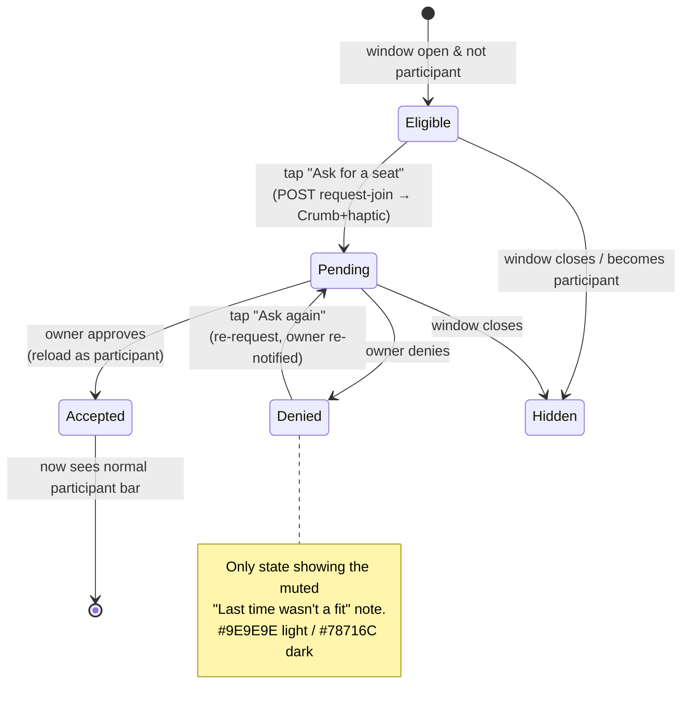
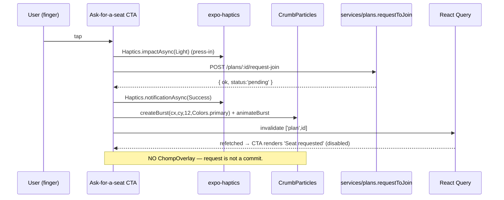

# UX Research — Public/Private Events + Request-to-Join + Discovery Feed

**Issue:** [#309](https://github.com/jronnomo/Chewgether/issues/309) · **PRD:** `docs/prds/PRD-public-private-events-request-to-join.md` · **Date:** 2026-06-05
**Surfaces:** (1) visibility selector · (2) Request-to-join CTA · (3) owner Requests section · (4) Friends-tab Discover feed
**Locked (not reopened):** visibility values `public`/`private`/`friends_request`, default `private`; public = view+request; friends_request = accepted friends only; approve → accepted invitee; denial re-requestable; non-participants never see vote/swipe data; backend contract fixed.

> Brand-voice note (load-bearing per `product_thesis`): the Chomp is reserved for genuine commits. Request-**submit** and **approve** are positive-but-not-commit moments, so they use **CrumbParticles + a graded haptic**, never the ChompOverlay. The earned celebration stays special.

---

## 1. Current-State Audit

| # | Surface | Finding (`file:line`) | User impact |
|---|---------|----------------------|-------------|
| A | plan-event control style | `BudgetSegmentedControl` (`components/BudgetSegmentedControl.tsx:16`) is a single-line sliding-indicator control — **text only, no icon/subtext slot**. Date chips (`app/plan-event.tsx:793`) and cuisine chips (`:916`) are pill rows. | The 3-way visibility control needs icon + label + helper subtext per option; neither existing control carries subtext. A new **sibling variant** of the segmented control is required — but it must visually match (same radius 12, sliding `Colors.primary` indicator, `minHeight:44`) so it doesn't read as a new control style. |
| B | plan-detail action bar | `PlanActionBar` (`app/plan-detail.tsx:666`) is a closed state machine over `phase` × invite status. There is **no branch for an eligible non-participant** — today such a user can't even reach this screen. | "Request to join" is a brand-new CTA branch; it must slot into the existing `barStyle` row without disturbing accept/decline/voting/manage branches. |
| C | plan-detail owner sections | Sections render in a single `ScrollView` (`app/plan-detail.tsx:1256-1309`): When → Where → **WHO'S AT THE TABLE** (`AttendeeSection`, `:449`) → THE DETAILS. Row model = avatar + name + status chip. | `JoinRequestsSection` should sit **directly above WHO'S AT THE TABLE** (requests are the pre-cursor to "at the table"); reuse the `AttendeeSection` row metrics. |
| D | plan-detail celebration wiring | `CrumbParticles` + `bursts` state + `createBurst`/`animateBurst` + `Haptics.notificationAsync(Success)` are **already wired** (`:54-55,953-960,1352`). | Request-submit and approve can reuse this exact burst pipeline — zero new animation infra. |
| E | Friends tab structure | Friends tab is a **3-way tab switcher** `friends`/`requests`/`add` (`app/(tabs)/friends/index.tsx:326`), each rendering its own `FlatList`. There is **no single scroll** to drop a section "above the friends list" as a sibling. | The Discover feed must render inside the `friends` tab's FlatList via `ListHeaderComponent` (above friend rows) — NOT as a 4th tab and NOT a sibling `<View>`. Friend-request rows (`renderRequest`, `:281`) are the visual model for approve/deny styling. |
| F | PlanCard affordance gap | `PlanCard` (`components/PlanCard.tsx:139`) shows owner crown + **accepted/pending tally** in its footer (`:103-108`) and is wrapped in `SizzleShimmer`. | For Discover, a non-participant must NOT see the accepted/pending tally (PRD §3.3) and DOES need a "you can request"/"Requested" affordance. PlanCard needs a **minimal additive prop** (`discoverStatus?`) that (a) suppresses the participant tally and (b) renders a request pill — rather than a fork of the component. |
| G | Token vocabulary | `success + '18'` is the established translucent-chip pattern (`plan-detail.tsx:519`); `primaryLight`/`secondaryLight` back the cuisine/budget tags. Dark mode flips `primary #E85D3A → #FF7A5C` and text-on-accent must be `#1C1917` (dark) vs `#FFFFFF` (light). | All new chips/pills should reuse `+'18'` translucency and the existing light pairs; **never hardcode** — every helper calls `useColors()`. |

---

## 2. Chosen Direction (one paragraph)

**"Same table, one more seat."** Treat the entire feature as an extension of the existing *table* metaphor already running through plan-detail ("WHO'S AT THE TABLE", "Chomp — I'm in!", "chomping / nibbling / passed"). The visibility selector answers *"Who can pull up a chair?"*; the request CTA is *"Ask for a seat"*; the owner approves with *"Seat 'em"*; the Discover feed is *"Tables you could join."* This keeps zero new metaphors, reuses `AttendeeSection`/`renderRequest` row geometry, the `BudgetSegmentedControl` indicator mechanics, the CrumbParticles burst pipeline, and `PlanCard` — so the feature feels grafted onto Chewabl rather than bolted on. **Grafted from runners-up:** the *segmented control with stacked icon+label+subtext* (from the "richer card-segment" option, chosen over a plain pill row because three visibility modes each need a one-line explanation); the *count badge on the Requests section header* (from the "inbox" option, scaled down to a single badge rather than a full inbox, respecting out-of-scope §3.3); and the *footer-pill request affordance on PlanCard* (from the "overlay ribbon" option, rejected because an overlay fights `SizzleShimmer`).

---

## 3. Phase-A Options (ASCII, ≤390pt column)

<details><summary><b>Surface 1 — Visibility selector (plan-event)</b> — 3 competing directions</summary>

```
OPTION 1A — Stacked card-segments (CHOSEN)            OPTION 1B — Pill row + live subtext
┌─ Who can pull up a chair? ────────────┐   ┌─ Who can pull up a chair? ───────────┐
│ ┌────────┐┌────────┐┌────────┐        │   │ (•Private) ( Friends ) ( Public )    │
│ │  🔒    ││  👥    ││  🌐    │        │   │ ───────────────────────────────────  │
│ │Private ││Friends ││ Public │        │   │ Only people you invite can see this. │
│ │invite- ││can ask ││anyone  │        │   └──────────────────────────────────────┘
│ │ only   ││to join ││can ask │        │   - reuses cuisine-chip row exactly
│ └━━━━━━━━┘└────────┘└────────┘        │   - subtext updates below the row
│  ^selected: primary fill + white text │   - CON: 3 modes need persistent context,
└───────────────────────────────────────┘     one rotating line is easy to miss
 - sibling of BudgetSegmentedControl: same
   r=12 container, sliding primary indicator
   BEHIND the 3 cells, minHeight>=64 (icon+
   2 lines). Selected cell: white icon+text.
 - PRO: each mode self-explains; matches the
   "icon + label" language of date chips.

OPTION 1C — Single row, expanding helper drawer
┌─ Visibility ──────────────────────────┐
│ [🔒 Private ▾]                         │   - compact collapsed; taps expand a
│   Only invitees see & join. (default)  │     radio drawer. CON: hides 2 of 3
└───────────────────────────────────────┘     options; extra tap; unlike any
                                               existing control. REJECTED.
LIGHT selected  bg #E85D3A / text #FFFFFF / unselected text #6B6B6B on card #FFFFFF
DARK  selected  bg #FF7A5C / text #1C1917 / unselected text #A8A29E on card #292524
```
</details>

<details><summary><b>Surface 2 — Request-to-join CTA (plan-detail action bar)</b></summary>

```
OPTION 2A — Single primary CTA (CHOSEN)        OPTION 2B — CTA + inline eligibility line
┌─ action bar ──────────────────────────┐   ┌─ action bar ─────────────────────────┐
│  ┌──────────────────────────────────┐ │   │ Maya's table · friends can ask       │
│  │       Ask for a seat 🍽          │ │   │ ┌──────────────────────────────────┐ │
│  └──────────────────────────────────┘ │   │ │      Ask for a seat              │ │
└───────────────────────────────────────┘   │ └──────────────────────────────────┘ │
 STATE: none → tappable (primary)            └──────────────────────────────────────┘
                                              - CON: action bar is tight; the eligibility
 PENDING:                                       line is better in the header, not the bar.
┌───────────────────────────────────────┐
│  ┌──────────────────────────────────┐ │   STATE machine (2A):
│  │   ⏳ Seat requested  (disabled)   │ │   none ──tap──▶ pending  (Crumb burst+haptic)
│  └──────────────────────────────────┘ │   pending ─approved─▶ (screen reloads as
└───────────────────────────────────────┘            accepted participant → normal bar)
 DENIED (re-requestable):                    pending ─denied──▶ denied
┌───────────────────────────────────────┐   denied ──tap───▶ pending (re-request)
│  Last time wasn't a fit — try again?  │   (muted note ONLY in denied state)
│  ┌──────────────────────────────────┐ │
│  │       Ask again                  │ │   LIGHT btn bg #E85D3A txt #FFF; disabled
│  └──────────────────────────────────┘ │         opacity 0.5; muted note #9E9E9E
└───────────────────────────────────────┘   DARK  btn bg #FF7A5C txt #1C1917; note #78716C
```
</details>

<details><summary><b>Surface 3 — Owner Requests section (plan-detail)</b> — see committed SVG for hi-fi</summary>

```
OPTION 3A — Echo AttendeeSection rows (CHOSEN)   OPTION 3B — Compact stacked-avatar summary
┌─ REQUESTS TO JOIN  (2) ───────────────┐   ┌─ 2 people want in ───────────────────┐
│ (🍜) Maya Chen          [Seat 'em][×] │   │ (🍜)(🥗)  Review requests  ▸          │
│      wants a seat at the table        │   └──────────────────────────────────────┘
│ ─────────────────────────────────────  │   - opens a sheet. CON: extra navigation
│ (🥗) Devon Park         [Seat 'em][×] │     for a 2-tap action; hides the primary
│      friend of yours · wants in       │     approve/deny affordance. REJECTED for
└───────────────────────────────────────┘     low request volumes (defensive cap §3.2).
 - sits directly ABOVE "WHO'S AT THE TABLE"
 - [Seat 'em] = filled success #34C759 (echoes
   friends-tab respondBtnAccept); [×] = ghost
   border (echoes respondBtnDecline)
 - header count badge = primary circle (matches
   notification badge language)
 - HIDDEN entirely when 0 pending
 - approve: row slide-out 200ms + Crumb burst at
   button + Haptics.Success; requester appears as
   an accepted seat below. NOT a Chomp.
 - deny: row slide-out 200ms + Haptics.Light;
   no celebration (neutral, mirrors friend-decline)
```
</details>

<details><summary><b>Surface 4 — Discover feed (Friends tab)</b></summary>

```
OPTION 4A — ListHeader section in friends tab (CHOSEN)   OPTION 4B — 4th "Discover" tab
[ Friends | Requests | Add ]   ← existing 3-tab switcher  [Friends|Requests|Add|Discover]
┌──────────────────────────────────────┐                  - CON: 4 tabs overflow at 390pt
│ 🍽 TABLES YOU COULD JOIN              │                    (tabText already numberOfLines=1);
│ ┌──────────────────────────────────┐ │                    splits discovery from friends; a
│ │ Sushi Saturday      [Voting]     │ │                    new top-level surface for a
│ │ Sat, Jun 20 · Japanese · $$      │ │                    "Should Have". REJECTED.
│ │ 🌐 Public · hosted by Maya       │ │
│ │ ┌──────────────────────────────┐ │ │                  Card affordance (4A):
│ │ │   ✋ Ask for a seat           │ │ │                  - reuses PlanCard via new prop
│ │ └──────────────────────────────┘ │ │                    discoverStatus: null|'pending'
│ └──────────────────────────────────┘ │                  - prop SUPPRESSES the accepted/
│ ┌──────────────────────────────────┐ │                    pending tally footer (PRD §3.3)
│ │ Taco Tuesday        [Voting]     │ │                  - replaces footer with a single
│ │ ✓ Requested · waiting on host    │ │ ← pending state    request pill / requested chip
│ └──────────────────────────────────┘ │                  - host name + visibility icon shown
│         (— friend rows below —)       │                    (host is public info; tally is not)
└──────────────────────────────────────┘
 EMPTY: section + header omitted entirely (return null)   LOADING: one ActivityIndicator
 when getDiscoverFeed() returns []                          (Colors.primary) where section
                                                            would be; no skeleton cards.
```
</details>

---

## 4. Phase-B Technical Artifacts (chosen direction only)

### 4.1 Request → Approve lifecycle (flowchart)

```mermaid
flowchart TD
  A([Eligible non-participant on plan-detail]) -->|"Ask for a seat"| B{Request window open?<br/>status=voting & before rsvpDeadline}
  B -->|no| B2[CTA hidden / 400 surfaced via snackbar]
  B -->|yes| C[POST /plans/:id/request-join]
  C -->|ok status:pending| D[CTA flips to 'Seat requested' disabled<br/>Crumb burst + Haptics.Success]
  C -->|409 duplicate| D
  D --> E[[Owner notified: join_request_received]]
  E --> F[Owner opens plan-detail<br/>JoinRequestsSection shows badge]
  F -->|Seat 'em| G{Re-validate: still voting?<br/>friendship intact if friends_request?}
  G -->|no| G2[400 'No longer eligible' / 'can no longer accept']
  G -->|yes| H[approve → invites[] accepted<br/>request approved · row slide-out + Crumb]
  H --> I[[Requester notified: join_request_approved]]
  I --> J([Requester reloads as accepted participant<br/>full bar: Go to voting])
  F -->|Deny| K[deny → request denied · row slide-out · Haptics.Light]
  K --> L[[Requester notified: join_request_denied]]
  L --> M([Requester sees 'Ask again' CTA — re-requestable])
  M -->|tap| C
```

### 4.2 Request CTA state machine (stateDiagram)



### 4.3 Request-submit choreography (sequenceDiagram)



### 4.4 Animation timing (gantt — axis illustrative, real ms in labels)

```mermaid
gantt
  title Approve-request choreography (illustrative axis; ms + easing in labels)
  dateFormat SSS
  axisFormat %L
  section Tap feedback
  Haptics.impactAsync Light (press-in)        :a1, 000, 30ms
  section Network
  POST approve (await; spinner if >300ms)     :a2, after a1, 250ms
  section Reward
  Haptics.notificationAsync Success           :a3, after a2, 30ms
  Crumb burst scale-in spring tension~300     :a4, after a2, 250ms
  Crumb travel 40-120px timing                :a5, after a2, 400ms
  Crumb fade-out (delay 150 then 250)         :a6, after a2, 400ms
  section Row exit
  Row slide-out + height collapse cubic-out   :a7, after a2, 200ms
```



> ⚠ Every duration above is **provisional — playtest at 390pt.** Crumb numbers mirror the existing `animateBurst` (`components/CrumbParticles.tsx:67-103`); row slide-out (200ms) is a new value to verify against the friends-tab decline feel.

### 4.5 Component hierarchy + props/state

```
plan-event.tsx
  └─ VisibilitySegmentedControl  (NEW component, sibling of BudgetSegmentedControl)
       props: value: 'public'|'private'|'friends_request'; onSelect(v)
       options hardcoded with {icon, label, subtext}; default 'private'
       internal: const Colors = useColors(); sliding indicator (Animated, reuse mechanics)

plan-detail.tsx
  ├─ PlanActionBar (MODIFY)  — add branch: eligibleNonParticipant
  │     new props: canRequestJoin: boolean; joinStatus: 'none'|'pending'|'denied';
  │                onRequestJoin(); isRequestPending: boolean
  └─ JoinRequestsSection (NEW module-level helper — MUST call useColors() in body)
        props: requests: PlanJoinRequest[](pending only); onApprove(userId);
               onDeny(userId); pendingActionUserId?: string
        renders null when requests.length===0; row geometry from AttendeeSection
        placement: directly above <AttendeeSection> in the ScrollView

friends/index.tsx
  └─ DiscoverSection (NEW — rendered as ListHeaderComponent of the 'friends' FlatList)
        useQuery(['discoverFeed'], getDiscoverFeed)
        renders null when data empty; ActivityIndicator while loading
        maps → <PlanCard plan discoverStatus={plan.myJoinRequestStatus} onPress=push detail/>

PlanCard.tsx (MODIFY — additive)
  new prop: discoverStatus?: 'none'|'pending' (undefined = normal participant card)
  when set: suppress PlanCardFooter tally; render request pill ('none') or
            'Requested · waiting on host' chip ('pending'); show host + visibility icon
```

React Query keys: new `['discoverFeed']`; request/approve/deny mutations invalidate `['plan',id]`, `['plans']`, `['discoverFeed']`.

---

## 5. Animation Storyboard (frames; cross-ref §4.4 gantt)

**Request submit (Surface 2):**
1. **t0** finger down → `Haptics.impactAsync(Light)`, button scale 0.97 (reuse PlanCard press spring).
2. **t0+await** network; if >300ms show inline ActivityIndicator inside button.
3. **t1 (resolve)** `Haptics.notificationAsync(Success)` + `createBurst(cx,cy,12,Colors.primary)` at button center → crumbs spring out 40–120px, gravity bias, fade by ~650ms.
4. **t1** button label cross-fades to "Seat requested", goes disabled (opacity 0.5).
> No ChompOverlay. This is a Nibble-class reward (light, crumb burst), not a Chomp.

**Approve (Surface 3):** identical crumb+haptic burst at the "Seat 'em" button → row collapses (slide-out + height→0, cubic-out 200ms) → the approved person fades into WHO'S AT THE TABLE as an accepted seat (reuse the section's existing render).
**Deny (Surface 3):** row slide-out 200ms + `Haptics.impactAsync(Light)` only — neutral, mirroring friends-tab decline (`friends/index.tsx:127` comment: "Decline is a neutral acknowledgement, not a celebration").

---

## 6. Behavioral Psychology Principles (core)

| Principle | Where applied | Rationale |
|-----------|---------------|-----------|
| Default effect | Visibility defaults to **Private** | Safe default; preserves today's behavior & security posture; users opt into openness deliberately. |
| Goal-gradient / progress | Request CTA flips to a clear "Seat requested" pending state | Confirms the action landed; removes uncertainty that drives re-taps and duplicate requests. |
| Variable reward, sized to occasion | Crumb burst (not Chomp) on submit/approve | A small earned delight reinforces the action without spending the Chomp budget — keeps the Chomp special (`product_thesis`). |
| Loss-aversion softened | Denied state: "Last time wasn't a fit — try again?" | Reframes rejection as a retry path, not a dead end; lowers the social sting of denial. |
| Social proof / belonging | "Tables you could join", host name + avatar on Discover cards | Friends' activity is the strongest pull; surfacing the host humanizes the request. |
| Authority/control retention | Owner-only "Seat 'em / ×" with count badge | Owner stays in control; the badge creates a light, actionable nudge without an inbox. |
| Privacy as trust | Tally/votes hidden from non-participants on cards & detail | Visible data minimization signals the app protects in-group behavior — builds trust to go public. |
| Recognition over recall | Visibility options each carry one-line subtext | Users pick correctly without remembering what "friends_request" means. |

---

## 7. Implementation Scope

**Create:**
- `components/VisibilitySegmentedControl.tsx` — icon+label+subtext segmented control (sibling of `BudgetSegmentedControl`).
- `JoinRequestsSection` (module-level helper inside `app/plan-detail.tsx`).
- `DiscoverSection` (inside `app/(tabs)/friends/index.tsx`, used as the `friends` FlatList `ListHeaderComponent`).

**Modify:**
- `app/plan-event.tsx` — render the visibility control under a "Who can pull up a chair?" label; wire to create/edit + guest branch.
- `app/plan-detail.tsx` — add eligible-non-participant branch to `PlanActionBar`; render `JoinRequestsSection` above `AttendeeSection`; wire approve/deny mutations to the existing `bursts`/haptic pipeline.
- `components/PlanCard.tsx` — additive `discoverStatus?` prop (suppress tally, render request pill / requested chip, show host + visibility icon).
- `services/plans.ts` + `types/index.ts` — per PRD §4.1/§4.3 (already specified).

**testIDs (new):** `visibility-control`, `visibility-option-private|friends|public`, `plan-detail-request-join-btn`, `plan-detail-join-pending`, `plan-detail-join-denied`, `join-requests-section`, `join-request-row-<userId>`, `join-request-approve-<userId>`, `join-request-deny-<userId>`, `discover-section`, `discover-card-<planId>`.

**Complexity:** VisibilitySegmentedControl **M** (new control, but mechanics copied); JoinRequestsSection **S** (row model exists); PlanCard `discoverStatus` **S–M** (must not regress participant cards); DiscoverSection **S** (PlanCard + query). Overall **M**.

---

## 8. Accessibility

- **Touch targets ≥44pt:** visibility cells `minHeight:64`; "Seat 'em" 36pt tall → bump to **≥44pt** ⚠ (current friends-tab `respondBtn` should be checked too); request CTA full-width ≥44pt.
- **Contrast (both themes):** approve green `#34C759` on white text — verify AA at small size ⚠ (it's borderline for 11px bold; consider `success` text on `success+'18'` bg as the friends-tab does, OR keep filled but confirm). Selected segment: white `#FFFFFF` on `#E85D3A` (light) / `#1C1917` on `#FF7A5C` (dark) — both pass. Muted denied note uses `cautionText`/`textTertiary` per theme.
- **Labels:** segment `accessibilityState={{selected}}` + `accessibilityLabel` "Private — invite only" etc.; request CTA "Ask for a seat" / "Seat requested, waiting on host"; approve "Seat Maya Chen" / deny "Decline Maya Chen's request"; section count announced ("2 people want in").
- **Reduced motion:** Crumb burst + row slide-out must no-op under `AccessibilityInfo.isReduceMotionEnabled()` (SizzleShimmer already does this — follow that pattern); state still flips instantly.
- **maxFontSizeMultiplier:** keep `AppText` defaults; subtext lines use `variant="dense"`; visibility subtext must wrap, not truncate.
- **Dark mode:** every new helper declares `const Colors = useColors()` in its body (CLAUDE.md mandate).

---

## 9. ⚠ Provisional / Verify-Visually list

| Item | Value (provisional) | Verify |
|------|--------------------|--------|
| Visibility cell height | `minHeight 64` (icon + 2 lines) | reads at 390pt with 3 cells side-by-side without truncation |
| Sliding indicator behind 3 stacked cells | reuse spring tension 300 / friction 12 | indicator aligns under taller cells |
| Approve/Deny button height | 36pt drawn | **bump to ≥44pt** for a11y |
| Approve green contrast | `#34C759` + white 11px bold | AA at small size — may need `success`-text-on-tint instead of filled |
| Row slide-out duration | 200ms cubic-out | feel vs friends-tab decline; playtest |
| Crumb burst count on approve | 12 (matches detail) | enough delight, not noisy, at button scale |
| Discover card request pill placement | replaces footer | confirm it doesn't fight `SizzleShimmer` sweep |
| "Requested" chip styling | `secondary`/`secondaryLight` (matches "nibbling") | distinct from accepted green |
| Count badge on Requests header | primary circle, 20pt | matches notification badge scale |

---

## 10. What Makes It Unique / On-Brand / Insightful (flavor)

Chewabl already runs one quiet, consistent metaphor through its most-used screen: the **table**. Plan-detail doesn't say "members" — it says *WHO'S AT THE TABLE*. RSVP isn't "yes" — it's *"Chomp — I'm in!"* People aren't "pending" — they're *nibbling*; people who decline *passed*. This feature's whole job is to let one more person pull up a chair, so the design refuses to invent a second vocabulary. The visibility selector asks **"Who can pull up a chair?"** The request CTA is **"Ask for a seat."** The owner approves with **"Seat 'em."** The discovery feed is **"Tables you could join."** Nothing here is a new concept the user has to learn — it's the table they already know, with the door opened a crack.

The restraint is the insight. The temptation in a request-to-join flow is to make *approval* feel huge — confetti, a Chomp, a full-screen bite. But Chewabl's `product_thesis` is explicit: **the Chomp is an animation budget spent only on real commits, and restraint is what keeps it special.** Approving a join request is the owner doing a chore well, not committing to dinner. So approval gets a **Crumb burst** — the same warm, small reward already used for positive button feedback (`CrumbParticles`) — plus a graded `Haptics.Success`, and the row slides away. The genuine Chomp stays reserved for the moments that earn it (RSVP accept, results reveal, theme toggle). Denial gets even less — a neutral slide-out and a `Light` haptic, mirroring the existing friends-tab decline, which the codebase itself annotates as *"a neutral acknowledgement, not a celebration."*

And the warmth shows up exactly where the thesis says it matters most — the bad moments. A **denied** request doesn't dead-end with a cold "Request denied." It softens into a next step: *"Last time wasn't a fit — try again?"* with an **"Ask again"** button. An **empty** Discover feed doesn't shout "Nothing here" — it simply isn't there (the section hides), so a user with no joinable tables never feels a void. A **private** plan a stranger tries to reach returns a clean 404, not an accusatory 403. Every failure is folded into the warm, food-pun voice the brand is built on — which is the whole point: the worst moments are where the voice is load-bearing.

**DNA traced back to existing features:** the *table* language → `AttendeeSection` "WHO'S AT THE TABLE"; the Crumb reward → `CrumbParticles` + the plan-detail accept burst; the Chomp restraint → `ThemeTransitionContext` Chomp configs reserved for commits; the approve/deny row → friends-tab `renderRequest` (and its decline-is-neutral comment); the segmented control → `BudgetSegmentedControl`; the discovery card → `PlanCard` + `SizzleShimmer`. The feature is almost entirely a recombination of parts Chewabl already ships — which is exactly why it should feel native.

*Specialists: Data/Behavior, RN/Animation, UI/Brand — orchestrated for issue #309.*

---

## 11. Recommendation Ledger

> Implementing PR ticks each row to `shipped`/`reworked`/`dropped` with a SHA / `file:line` / short reason. ⚠ rows are the audit-critical ones.

| ID | Recommendation | Type | Status | Evidence |
|----|----------------|------|--------|----------|
| UXR-309-01 | "Who can pull up a chair?" label + table metaphor across all 4 surfaces | copy | proposed | |
| UXR-309-02 | VisibilitySegmentedControl as icon+label+subtext sibling of BudgetSegmentedControl (not a new control style) | component | proposed | |
| UXR-309-03 | Default selection = Private | layout | proposed | |
| UXR-309-04 | Request CTA "Ask for a seat" → "Seat requested" (pending, disabled) → "Ask again" (denied) | copy | proposed | |
| UXR-309-05 | Add eligible-non-participant branch to PlanActionBar | component | proposed | |
| UXR-309-06 | JoinRequestsSection above WHO'S AT THE TABLE; row geometry from AttendeeSection; hidden when empty | layout | proposed | |
| UXR-309-07 | Approve label "Seat 'em" filled-success; Deny ghost-× (echo friends-tab respondBtn) | copy | proposed | |
| UXR-309-08 | Count badge on Requests header (primary circle) | layout | proposed | |
| UXR-309-09 | Discover feed as ListHeaderComponent of 'friends' FlatList (not a 4th tab) | layout | proposed | |
| UXR-309-10 | PlanCard additive `discoverStatus` prop: suppress tally, render request pill / "Requested" chip, show host+visibility | component | proposed | |
| UXR-309-11 | Discover/empty: hide section entirely; loading: single ActivityIndicator | layout | proposed | |
| UXR-309-12 | Request-submit & approve reward = CrumbParticles + Haptics.Success (NOT Chomp) | animation | proposed | |
| UXR-309-13 | Deny = neutral slide-out + Haptics.Light, no celebration | animation | proposed | |
| UXR-309-14 | Denied microcopy "Last time wasn't a fit — try again?" + muted "previously declined" note | copy | proposed | |
| UXR-309-15 | Visibility cell minHeight ~64 reads at 390pt without truncation | tuning⚠ | proposed | |
| UXR-309-16 | Approve/Deny button height ≥44pt (drawn at 36) | a11y | proposed | |
| UXR-309-17 | Approve green #34C759 + white 11px contrast — verify AA, consider tint-bg variant | tuning⚠ | proposed | |
| UXR-309-18 | Row slide-out 200ms cubic-out | tuning⚠ | proposed | |
| UXR-309-19 | Crumb burst count 12 on approve at button scale | tuning⚠ | proposed | |
| UXR-309-20 | Discover request-pill placement vs SizzleShimmer sweep | decoration⚠ | proposed | |
| UXR-309-21 | "Requested" chip uses secondary/secondaryLight (echoes "nibbling"), distinct from accepted green | tuning⚠ | proposed | |
| UXR-309-22 | Requests-header count badge scale 20pt matches notification badge | tuning⚠ | proposed | |
| UXR-309-23 | Crumb burst + row slide-out + sliding indicator no-op under reduced motion | a11y | proposed | |
| UXR-309-24 | All new helpers declare const Colors = useColors() in body; both themes verified | a11y | proposed | |

---

### Microcopy reference tables (flavor)

**Visibility selector**

| Mode | Label | Subtext |
|------|-------|---------|
| private | Private | Only people you invite. (default) |
| friends_request | Friends | Friends can ask to join. |
| public | Public | Anyone can ask to join. |

**Request CTA states**

| State | Button | Note |
|-------|--------|------|
| none | Ask for a seat | — |
| pending | Seat requested | (disabled) |
| denied | Ask again | Last time wasn't a fit — try again? |

**Owner approval**

| Action | Button | On success |
|--------|--------|-----------|
| approve | Seat 'em | (Crumb burst + Success haptic; row slides out) |
| deny | × | (neutral slide-out + Light haptic) |

**Empty / edge states**

| Surface | Copy |
|---------|------|
| Discover empty | (section hidden — no copy shown) |
| Discover loading | spinner only |
| Request to private | "This plan is invite-only" (snackbar from 403) |
| Approve too late | "This table's already set" (from 400) |
| No longer friends | "Looks like you're no longer connected" (from 400) |

---
*Phone-frame SVG (owner Requests section, light+dark): `plan-detail-requests-section.svg` in this folder.*
